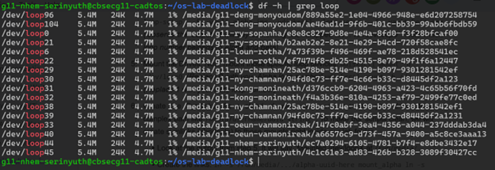
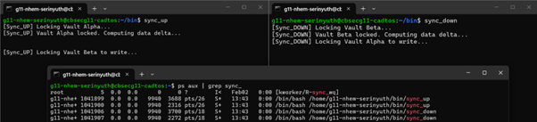
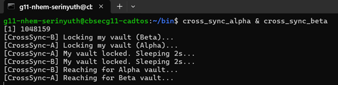
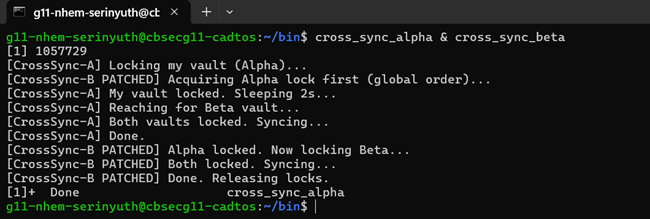
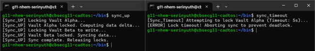
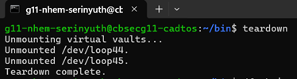
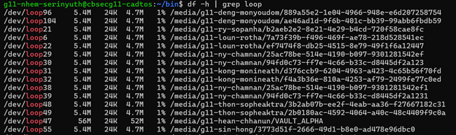

# OS Lab - Bash Script 3 and Deadlock
**Name:** Nhem Sun Serinyuth  
**Gen:** 11 | Cyber | G2  
**ID:** IDTB110255  

---

## Level 1 — Virtual Vault Provisioning

**Explanation:** The `df -h | grep loop` output shows two loopback devices (`/dev/loop44` and `/dev/loop45`) successfully mounted and active on the system. This proves that the two virtual drive image files (`vault_alpha.img` and `vault_beta.img`) have been correctly attached to loop devices and formatted with a working ext4 filesystem, because the OS is now able to report their size, used space, and available space — just as it would for a real physical hard drive.

## Level 3 — The Local Deadlock

**Explanation:** Both `sync_up` and `sync_down` froze indefinitely and never reached "Sync complete." `sync_up` held the Alpha lock (fd 200) and was waiting for the Beta lock (fd 201). `sync_down` held the Beta lock (fd 201) and was waiting for the Alpha lock (fd 200). Since neither process releases its held lock until it acquires the second one, and neither can acquire the second one because the other process holds it, both processes are stuck forever in a circular wait — the classic deadlock condition.

## Level 4 — Site-to-Site Sync (Multiplayer Deadlock)

**Explanation:** I simulated the distributed deadlock alone by creating two directories — `public_dr_alpha` and `public_dr_beta` — each with their own `vault.lock` file, acting as two separate sites.

When `cross_sync_alpha` and `cross_sync_beta` ran simultaneously, `cross_sync_alpha` held Alpha's lock and waited for Beta's, while `cross_sync_beta` held Beta's lock and waited for Alpha's. Both scripts froze forever — neither could proceed because each was waiting for a lock the other was holding.

This simulates a distributed denial of service where two systems freeze each other entirely due to a locking design flaw, not an external attack.

## Level 5 — Global Resource Ordering (The Patch)

**Explanation:** After patching `cross_sync_beta` to always acquire Alpha's lock first, both scripts ran simultaneously without deadlocking. One script acquired Alpha's lock and ran to completion while the other waited. Once the first finished and released its locks, the second acquired them and completed successfully.

The circular wait was broken because both scripts now request locks in the same global order — Alpha always before Beta. It is impossible for a deadlock cycle to form when all processes compete for the same first resource.

## Level 6 — Deadlock Recovery (The Timeout Patch)

**Explanation:** While `sync_up` was holding Alpha's lock, `sync_timeout` tried to acquire it but gave up after 5 seconds and printed an error message instead of freezing.

This is useful because a process that automatically aborts frees up system resources immediately, keeping the server responsive without needing manual intervention.

## Level 7 — Safe Ejection (Teardown)

**Explanation:** After running `teardown`, `df -h | grep loop` no longer shows any mounted loop devices for my account. Both virtual drives were cleanly unmounted and their loop devices detached from the kernel.

Proper teardown is critical because unmounting while data is being written can corrupt the filesystem. Leaving orphaned loop devices also wastes kernel resources that persist until the server reboots.

## Git Repository

[https://github.com/SERINYUTH/os-lab-deadlock-IDTB110255.git](https://github.com/SERINYUTH/os-lab-deadlock-IDTB110255.git)